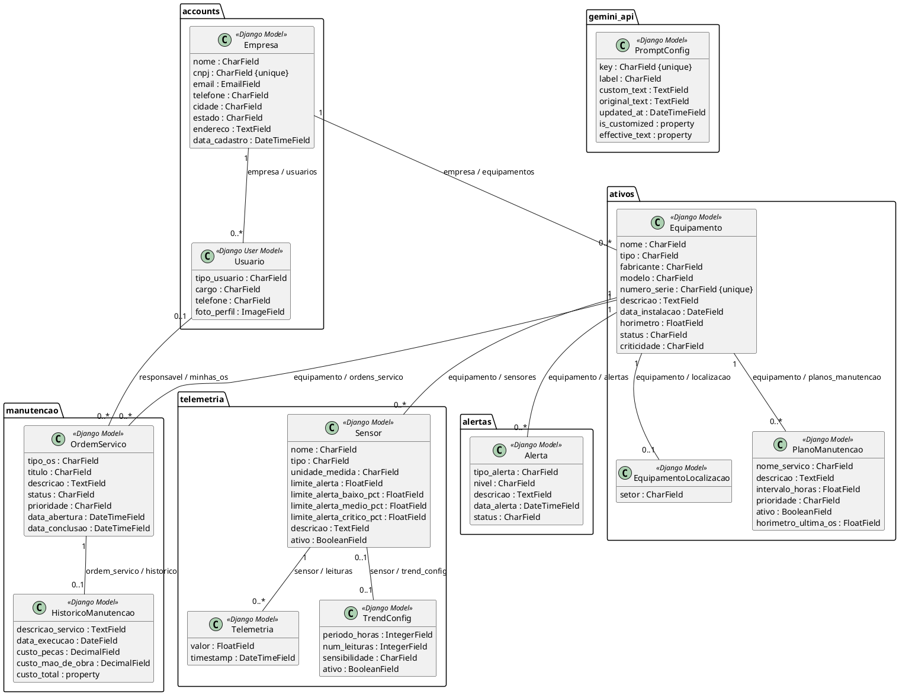

# Diagrama de Classes Completo do NanaSmart

## Guia baseado no código atual do repositório

**Data do levantamento:** 21/09/2026  
**Projeto:** NanaSmart  
**Escopo:** modelos persistidos, serviços, padrões de projeto, API, serializers, permissões, eventos e integrações.

> Este documento descreve classes e relações encontradas nos arquivos Python atuais. Não foram adicionadas classes de domínio que não existam no código. Classes fornecidas pelo Django, Django REST Framework, django-filter, ReportLab, OpenPyXL e Google GenAI aparecem apenas como dependências externas.

---

## 1. Como usar este documento

Para criar o diagrama completo, monte o desenho em camadas:

1. **Domínio e persistência:** classes que herdam de `models.Model` ou `AbstractUser`.
2. **API:** `ViewSet`, `APIView`, serializers e filtros.
3. **Serviços:** contexto, KPIs, análise de tendência e cliente Gemini.
4. **Padrões de projeto:** factories, policies, builder e exportadores.
5. **Eventos:** receivers registrados nos sinais `post_save` e `pre_save`.
6. **Infraestrutura:** URLs e classes externas do Django/DRF.

A recomendação é fazer primeiro o diagrama de domínio e depois adicionar as demais camadas com dependências tracejadas. Não é necessário desenhar cada classe de teste, migration, configuração de admin ou comando de gerenciamento no diagrama principal.

### Legenda de relações

| Notação | Significado |
|---|---|
| `1 -- *` | Um para muitos |
| `1 -- 0..1` | Um para zero ou um |
| `..|>` | Herança ou implementação |
| `-->` | Dependência/uso |
| `..>` | Dependência tracejada |
| `o--` | Agregação conceitual |
| `*--` | Composição conceitual |

Nas relações de banco, considere também o comportamento de `on_delete` informado no código.

---

# 2. Visão geral dos módulos

| Módulo | Responsabilidade | Principais classes |
|---|---|---|
| `accounts` | Empresas, usuários e permissões | `Empresa`, `Usuario`, policies e permissions |
| `ativos` | Equipamentos, localizações e planos | `Equipamento`, `EquipamentoLocalizacao`, `PlanoManutencao` |
| `telemetria` | Sensores, leituras e tendências | `Sensor`, `Telemetria`, `TrendConfig`, `TelemetriaFilter` |
| `alertas` | Alertas de equipamentos | `Alerta` |
| `manutencao` | Ordens e histórico | `OrdemServico`, `HistoricoManutencao`, filtros e permissions |
| `manutencao.dashboards` | Indicadores de manutenção | `KpiService`, views de dashboard |
| `gemini_api` | Prompts, configurações e IA | `PromptConfig`, builders, views e serializers |
| `exportacao` | Exportação de dados | `Exportador`, exporters e views |
| `authentication` | Perfil e troca de senha | `MeView`, `ChangePasswordView` |

---

# 3. Diagrama de domínio: classes persistidas

## 3.1 `accounts.models.Empresa`

**Arquivo:** `accounts/models.py`

```text
Empresa : models.Model
----------------------------------------
- nome : CharField(max_length=255)
- cnpj : CharField(max_length=18, unique=True)
- email : EmailField
- telefone : CharField(max_length=20, null=True, blank=True)
- cidade : CharField(max_length=100, null=True, blank=True)
- estado : CharField(max_length=50, null=True, blank=True)
- endereco : TextField(null=True, blank=True)
- data_cadastro : DateTimeField(auto_now_add=True)
----------------------------------------
+ __str__() : str
```

### Relações

- Uma `Empresa` possui muitos `Usuario` pelo relacionamento `Usuario.empresa`.
- Uma `Empresa` possui muitos `Equipamento` pelo relacionamento `Equipamento.empresa`.
- `Usuario.empresa`: `ForeignKey`, `on_delete=models.CASCADE`, `related_name='usuarios'`.
- `Equipamento.empresa`: `ForeignKey`, `on_delete=models.CASCADE`, `related_name='equipamentos'`.

---

## 3.2 `accounts.models.Usuario`

**Arquivo:** `accounts/models.py`

```text
Usuario : AbstractUser
----------------------------------------
+ campos herdados de AbstractUser
- empresa : ForeignKey[Empresa]
          null=True, blank=True
          related_name='usuarios'
          on_delete=CASCADE
- tipo_usuario : CharField(max_length=20)
                 default='tecnico'
                 choices={admin, gestor, tecnico}
- cargo : CharField(max_length=100, null=True, blank=True)
- telefone : CharField(max_length=20, null=True, blank=True)
- foto_perfil : ImageField(upload_to='perfil_fotos/', null=True, blank=True)
----------------------------------------
+ __str__() : str
```

### Relações

- `Usuario` herda de `django.contrib.auth.models.AbstractUser`.
- Cada `Usuario` pode estar associado a zero ou uma `Empresa`.
- Uma `Empresa` pode ter vários `Usuario`.
- `OrdemServico.responsavel` referencia `Usuario` com `on_delete=SET_NULL`, portanto a ordem pode permanecer sem responsável.

---

## 3.3 `ativos.models.Equipamento`

**Arquivo:** `ativos/models.py`

```text
Equipamento : models.Model
----------------------------------------
- empresa : ForeignKey[Empresa]
            related_name='equipamentos'
            on_delete=CASCADE
- nome : CharField(max_length=255)
- tipo : CharField(max_length=100, null=True, blank=True)
- fabricante : CharField(max_length=100, null=True, blank=True)
- modelo : CharField(max_length=100, null=True, blank=True)
- numero_serie : CharField(max_length=100, unique=True)
- descricao : TextField(null=True, blank=True)
- data_instalacao : DateField(null=True, blank=True)
- horimetro : FloatField(default=0)
- status : CharField(max_length=20, default='ativo')
- criticidade : CharField(max_length=20, default='normal')
----------------------------------------
+ __str__() : str
```

### Choices declarados

- `tipo`: `motor_eletrico`, `bomba_hidraulica`, `compressor_ar`, `gerador`, `prensa`, `esteira`, `ventilador`, `outro`.
- `status`: `ativo`, `manutencao`, `inativo`.
- `criticidade`: `normal`, `alta`.

### Relações

- Uma `Empresa` possui vários `Equipamento`.
- Um `Equipamento` possui zero ou uma `EquipamentoLocalizacao`.
- Um `Equipamento` possui vários `PlanoManutencao`.
- Um `Equipamento` possui vários `Sensor`.
- Um `Equipamento` possui vários `Telemetria` indiretamente por seus sensores.
- Um `Equipamento` possui vários `Alerta`.
- Um `Equipamento` possui várias `OrdemServico`.

---

## 3.4 `ativos.models.EquipamentoLocalizacao`

```text
EquipamentoLocalizacao : models.Model
----------------------------------------
- equipamento : OneToOneField[Equipamento]
                related_name='localizacao'
                on_delete=CASCADE
- setor : CharField(max_length=100)
----------------------------------------
+ __str__() : str
```

### Relação

- `EquipamentoLocalizacao.equipamento` é uma relação um para um obrigatória no banco, com `related_name='localizacao'`.

---

## 3.5 `ativos.models.PlanoManutencao`

```text
PlanoManutencao : models.Model
----------------------------------------
- equipamento : ForeignKey[Equipamento]
                related_name='planos_manutencao'
                on_delete=CASCADE
- nome_servico : CharField(max_length=200)
- descricao : TextField
- intervalo_horas : FloatField
- prioridade : CharField(max_length=20, default='media')
- ativo : BooleanField(default=True)
- horimetro_ultima_os : FloatField(default=0)
----------------------------------------
+ save(*args, **kwargs)
+ __str__() : str
```

### Choices declarados

- `prioridade`: `baixa`, `media`, `alta`, `critica`.

### Comportamento relevante

- Na criação, `save()` inicializa `horimetro_ultima_os` com o `horimetro` atual do equipamento.
- `ativos.signals.verificar_planos_por_horimetro` usa esta classe para criar ordens preditivas.

---

## 3.6 `telemetria.models.Sensor`

**Arquivo:** `telemetria/models.py`

```text
Sensor : models.Model
----------------------------------------
- equipamento : ForeignKey[Equipamento]
                related_name='sensores'
                on_delete=CASCADE
- nome : CharField(max_length=100)
- tipo : CharField(max_length=50)
- unidade_medida : CharField(max_length=20)
- limite_alerta : FloatField
- limite_alerta_baixo_pct : FloatField(null=True, blank=True)
- limite_alerta_medio_pct : FloatField(null=True, blank=True)
- limite_alerta_critico_pct : FloatField(null=True, blank=True)
- descricao : TextField(null=True, blank=True)
- ativo : BooleanField(default=True)
----------------------------------------
+ clean()
+ save(*args, **kwargs)
+ __str__() : str
```

### Choices declarados

- `tipo`: `temperatura`, `vibracao`, `pressao`, `corrente`, `umidade`.

### Comportamento relevante

- `clean()` aplica valores padrão de percentual: baixo `70.0`, médio `85.0`, crítico `100.0`.
- Valida que os percentuais estejam entre `0` e `100` e que baixo < médio < crítico.
- `save()` chama `full_clean()` antes de salvar.

---

## 3.7 `telemetria.models.Telemetria`

```text
Telemetria : models.Model
----------------------------------------
- sensor : ForeignKey[Sensor]
           related_name='leituras'
           on_delete=CASCADE
- valor : FloatField
- timestamp : DateTimeField(auto_now_add=True)
----------------------------------------
+ __str__() : str
```

### Meta

- `verbose_name_plural = 'Telemetrias'`.
- `ordering = ['-timestamp']`.

### Relação

- Um `Sensor` possui várias leituras de `Telemetria`.

---

## 3.8 `telemetria.models.TrendConfig`

```text
TrendConfig : models.Model
----------------------------------------
- sensor : OneToOneField[Sensor]
           null=True, blank=True
           related_name='trend_config'
           on_delete=CASCADE
- periodo_horas : IntegerField(default=24)
- num_leituras : IntegerField(default=50)
- sensibilidade : CharField(max_length=20, default='media')
- ativo : BooleanField(default=True)
----------------------------------------
+ __str__() : str
```

### Choices declarados

- `sensibilidade`: `baixa`, `media`, `alta`.

### Relação

- Uma configuração pode ser específica de um `Sensor` ou global quando `sensor=None`.
- A relação com um sensor é no máximo uma configuração por causa do `OneToOneField`.

---

## 3.9 `alertas.models.Alerta`

**Arquivo:** `alertas/models.py`

```text
Alerta : models.Model
----------------------------------------
- equipamento : ForeignKey[Equipamento]
                related_name='alertas'
                on_delete=CASCADE
- tipo_alerta : CharField(max_length=100)
- nivel : CharField(max_length=20, default='baixo')
- descricao : TextField
- data_alerta : DateTimeField(auto_now_add=True)
- status : CharField(max_length=20, default='ativo')
----------------------------------------
+ __str__() : str
```

### Choices declarados

- `nivel`: `baixo`, `medio`, `critico`.
- `status`: `ativo`, `resolvido`, `ignorado`.

### Relação

- Um `Equipamento` possui vários `Alerta`.

---

## 3.10 `manutencao.models.OrdemServico`

**Arquivo:** `manutencao/models.py`

```text
OrdemServico : models.Model
----------------------------------------
- equipamento : ForeignKey[Equipamento]
                related_name='ordens_servico'
                on_delete=CASCADE
- responsavel : ForeignKey[Usuario]
                null=True, blank=True
                related_name='minhas_os'
                on_delete=SET_NULL
- tipo_os : CharField(max_length=20, default='preventiva')
- titulo : CharField(max_length=200)
- descricao : TextField
- status : CharField(max_length=20, default='pendente')
- prioridade : CharField(max_length=20, default='baixa')
- data_abertura : DateTimeField(default=timezone.now)
- data_conclusao : DateTimeField(null=True, blank=True)
----------------------------------------
+ save(*args, **kwargs)
+ __str__() : str
```

### Choices declarados

- `tipo_os`: `corretiva`, `preditiva`, `preventiva`.
- `status`: `pendente`, `andamento`, `concluida`, `cancelada`.
- `prioridade`: `baixa`, `media`, `alta`, `critica`.

### Comportamento relevante

- Ao salvar com `status='concluida'` e sem data de conclusão, `save()` atribui `timezone.now()`.
- `manutencao.views.OrdemServicoViewSet` cria histórico para ordens concluídas.

---

## 3.11 `manutencao.models.HistoricoManutencao`

```text
HistoricoManutencao : models.Model
----------------------------------------
- ordem_servico : OneToOneField[OrdemServico]
                  related_name='historico'
                  on_delete=CASCADE
- descricao_servico : TextField
- data_execucao : DateField
- custo_pecas : DecimalField(max_digits=10, decimal_places=2, default=0.00)
- custo_mao_de_obra : DecimalField(max_digits=10, decimal_places=2, default=0.00)
----------------------------------------
+ custo_total : property -> Decimal
+ __str__() : str
```

### Relação

- Uma `OrdemServico` possui zero ou um `HistoricoManutencao`.
- `HistoricoManutencao` possui uma relação `OneToOneField` obrigatória para uma `OrdemServico`.

---

## 3.12 `gemini_api.models.PromptConfig`

**Arquivo:** `gemini_api/models.py`

```text
PromptConfig : models.Model
----------------------------------------
- key : CharField(max_length=50, unique=True)
- label : CharField(max_length=120, blank=True)
- custom_text : TextField(blank=True, default='')
- original_text : TextField(blank=True, default='')
- updated_at : DateTimeField(auto_now=True)
----------------------------------------
+ __str__() : str
+ is_customized : property -> bool
+ effective_text : property -> str
```

### Choices declarados em `PROMPT_KEYS`

- `system_instruction_tecnico`
- `system_instruction_gestor`
- `system_instruction_admin`
- `chat_context`
- `os_analysis`
- `unassigned_orders`
- `finance`

### Meta

- `ordering = ['key']`.
- O campo `key` é único.
- Não possui relação com outros models do projeto.

---

# 4. Relações do domínio em uma tabela

| Origem | Cardinalidade | Destino | Campo / `related_name` | Exclusão |
|---|---:|---|---|---|
| `Empresa` | 1 para muitos | `Usuario` | `Usuario.empresa` / `usuarios` | CASCADE |
| `Empresa` | 1 para muitos | `Equipamento` | `Equipamento.empresa` / `equipamentos` | CASCADE |
| `Equipamento` | 1 para zero ou um | `EquipamentoLocalizacao` | `localizacao.equipamento` / `localizacao` | CASCADE |
| `Equipamento` | 1 para muitos | `PlanoManutencao` | `plano.equipamento` / `planos_manutencao` | CASCADE |
| `Equipamento` | 1 para muitos | `Sensor` | `sensor.equipamento` / `sensores` | CASCADE |
| `Sensor` | 1 para muitos | `Telemetria` | `telemetria.sensor` / `leituras` | CASCADE |
| `Sensor` | 1 para zero ou um | `TrendConfig` | `trend_config.sensor` / `trend_config` | CASCADE |
| `Equipamento` | 1 para muitos | `Alerta` | `alerta.equipamento` / `alertas` | CASCADE |
| `Equipamento` | 1 para muitos | `OrdemServico` | `os.equipamento` / `ordens_servico` | CASCADE |
| `Usuario` | 1 para muitos | `OrdemServico` | `os.responsavel` / `minhas_os` | SET_NULL |
| `OrdemServico` | 1 para zero ou um | `HistoricoManutencao` | `historico.ordem_servico` / `historico` | CASCADE |

### Observação sobre nulidade

- `Usuario.empresa` pode ser nulo.
- `OrdemServico.responsavel` pode ser nulo.
- `TrendConfig.sensor` pode ser nulo para configuração global.
- `EquipamentoLocalizacao.equipamento` e `HistoricoManutencao.ordem_servico` não são declarados como nulos.

---

# 5. Classes de API e apresentação

As classes abaixo não são tabelas. Elas recebem requisições, aplicam permissões, consultam models e devolvem respostas HTTP.

## 5.1 Accounts

### `accounts.views.EmpresaViewSet`

Herda de `rest_framework.viewsets.ModelViewSet`.

```text
EmpresaViewSet
----------------------------------------
- serializer_class = EmpresaSerializer
- permission_classes = [IsGestor]
- filter_backends = [SearchFilter]
- search_fields = ['nome', 'cnpj']
----------------------------------------
+ get_queryset() : QuerySet[Empresa]
```

### `accounts.views.UsuarioViewSet`

Herda de `ModelViewSet`.

```text
UsuarioViewSet
----------------------------------------
- serializer_class = UsuarioSerializer
- permission_classes = [IsGestor]
- filter_backends = [DjangoFilterBackend, SearchFilter]
- filterset_fields = ['empresa', 'tipo_usuario', 'cargo']
- search_fields = ['first_name', 'last_name', 'email', 'username']
----------------------------------------
+ get_queryset() : QuerySet[Usuario]
+ perform_create(serializer)
```

### Relações de dependência

- `EmpresaViewSet --> EmpresaSerializer --> Empresa`.
- `UsuarioViewSet --> UsuarioSerializer --> Usuario`.
- Ambos usam `IsGestor`.

---

## 5.2 Ativos

### `ativos.views.EquipamentoViewSet`

Herda de `ModelViewSet`. Usa `EquipamentoSerializer` e permissões do módulo `accounts`.

### `ativos.views.EquipamentoLocalizacaoViewSet`

Herda de `ModelViewSet`. Usa `EquipamentoLocalizacaoSerializer`.

### `ativos.views.PlanoManutencaoViewSet`

Herda de `ModelViewSet`. Usa `PlanoManutencaoSerializer`.

### Relações

```text
EquipamentoViewSet ------------> EquipamentoSerializer ------------> Equipamento
EquipamentoLocalizacaoViewSet -> EquipamentoLocalizacaoSerializer -> EquipamentoLocalizacao
PlanoManutencaoViewSet --------> PlanoManutencaoSerializer --------> PlanoManutencao
```

---

## 5.3 Telemetria

### `telemetria.views.SensorViewSet`

Herda de `ModelViewSet`.

- Serializer: `SensorSerializer`.
- Permissão: `IsAuthenticatedNoDeleteForTecnico`.
- Filtra por equipamento, empresa, tipo, ativo e lista de IDs de equipamento.

### `telemetria.views.TelemetriaFilter`

Herda de `django_filters.rest_framework.FilterSet`.

```text
TelemetriaFilter
----------------------------------------
- valor_min : NumberFilter(valor >=)
- valor_max : NumberFilter(valor <=)
- timestamp_de : DateTimeFilter(timestamp >=)
- timestamp_ate : DateTimeFilter(timestamp <=)
----------------------------------------
- Meta.model = Telemetria
- Meta.fields = [sensor, sensor__equipamento, ...]
```

### `telemetria.views.TelemetriaViewSet`

Herda de `ModelViewSet`.

- Serializer: `TelemetriaSerializer`.
- Filtro: `TelemetriaFilter`.
- Permissão: `IsAuthenticatedNoDeleteForTecnico`.

### `telemetria.views.TrendConfigViewSet`

Herda de `ModelViewSet`.

- Serializer: `TrendConfigSerializer`.
- Model: `TrendConfig`.
- Permissão: `IsAuthenticatedNoDeleteForTecnico`.

### `telemetria.views.TrendDashboardView`

Herda de `APIView`.

```text
TrendDashboardView
----------------------------------------
+ get(request)
```

Usa as funções `analyze_sensor_trend()` e `get_all_sensor_trends()`.

---

## 5.4 Alertas

### `alertas.views.AlertaViewSet`

Herda de `ModelViewSet`.

- Serializer: `AlertaSerializer`.
- Model: `Alerta`.
- Aplica permissões definidas no código do módulo.

---

## 5.5 Manutenção

### `manutencao.views.HistoricoManutencaoFilter`

Herda de `django_filters.rest_framework.FilterSet`.

```text
HistoricoManutencaoFilter
----------------------------------------
- data_execucao_depois : DateFilter(gte)
- data_execucao_antes : DateFilter(lte)
----------------------------------------
- Meta.model = HistoricoManutencao
- Meta.fields = [ordem_servico,
                 ordem_servico__equipamento__empresa,
                 data_execucao_depois,
                 data_execucao_antes]
```

### `manutencao.views.OrdemServicoViewSet`

Herda de `ModelViewSet`.

```text
OrdemServicoViewSet
----------------------------------------
- serializer_class = OrdemServicoSerializer
- permission_classes = [IsAuthenticated,
                        IsOwnerOrGestorOrUnassigned]
- filterset_fields = [status, prioridade, equipamento,
                      equipamento__empresa, responsavel, tipo_os]
- search_fields = [titulo, descricao]
- ordering_fields = [data_abertura, prioridade, status]
- ordering = ['-data_abertura']
----------------------------------------
+ _ensure_history(ordem)
+ perform_create(serializer)
+ perform_update(serializer)
+ get_queryset() : QuerySet[OrdemServico]
```

### `manutencao.views.HistoricoManutencaoViewSet`

Herda de `ModelViewSet`.

- Serializer: `HistoricoManutencaoSerializer`.
- Filtro: `HistoricoManutencaoFilter`.
- Model: `HistoricoManutencao`.
- Permissão: `IsAuthenticatedNoDeleteForTecnico`.

---

## 5.6 Authentication

### `authentication.views.MeView`

Herda de `APIView`.

```text
MeView
----------------------------------------
- permission_classes = [IsAuthenticated]
- parser_classes = [MultiPartParser, FormParser]
----------------------------------------
+ get(request)
+ patch(request)
```

Usa `MeSerializer` e o usuário autenticado.

### `authentication.views.ChangePasswordView`

Herda de `APIView`.

```text
ChangePasswordView
----------------------------------------
- permission_classes = [IsAuthenticated]
----------------------------------------
+ post(request)
```

Usa `ChangePasswordSerializer` e os métodos de senha herdados pelo `Usuario`/`AbstractUser`.

---

# 6. Serializers

Todos os serializers abaixo são classes da API, não classes persistidas.

| Classe | Herda de | Model ou dados | Responsabilidade |
|---|---|---|---|
| `EmpresaSerializer` | `ModelSerializer` | `Empresa` | Serializa todos os campos |
| `UsuarioSerializer` | `ModelSerializer` | `Usuario` | Serializa perfil e empresa |
| `EquipamentoSerializer` | `ModelSerializer` | `Equipamento` | Serializa equipamento |
| `EquipamentoLocalizacaoSerializer` | `ModelSerializer` | `EquipamentoLocalizacao` | Serializa localização |
| `PlanoManutencaoSerializer` | `ModelSerializer` | `PlanoManutencao` | Serializa plano |
| `SensorSerializer` | `ModelSerializer` | `Sensor` | Serializa sensor |
| `TelemetriaSerializer` | `ModelSerializer` | `Telemetria` | Serializa leitura |
| `TrendConfigSerializer` | `ModelSerializer` | `TrendConfig` | Serializa configuração |
| `AlertaSerializer` | `ModelSerializer` | `Alerta` | Serializa alerta |
| `OrdemServicoSerializer` | `ModelSerializer` | `OrdemServico` | Valida isolamento, responsável e status |
| `HistoricoManutencaoSerializer` | `ModelSerializer` | `HistoricoManutencao` | Inclui `custo_total` como leitura |
| `MeSerializer` | `ModelSerializer` | `Usuario` | Perfil do usuário autenticado |
| `ChangePasswordSerializer` | `Serializer` | Dados de senha | Valida troca de senha |
| `GeminiHistoryItemSerializer` | `Serializer` | Estrutura de histórico | `role` e `text` |
| `GeminiMessageSerializer` | `Serializer` | Mensagem Gemini | `message` e `history` |
| `GeminiResponseSerializer` | `Serializer` | Resposta Gemini | `response` e `model_used` |
| `PromptConfigSerializer` | `ModelSerializer` | `PromptConfig` | Inclui propriedades calculadas |

### `OrdemServicoSerializer`: regras relevantes

- `data_abertura` e `data_conclusao` são somente leitura.
- Usuário não-admin só pode usar equipamento da própria empresa.
- Responsável deve pertencer à empresa do equipamento, exceto se for admin.
- Técnico só pode assumir ordens para si próprio.
- Técnico não pode editar ordem atribuída a outro técnico.
- Ordem concluída não pode voltar a outro status.
- Na criação/atualização, o técnico pode ser atribuído automaticamente em certas condições.

---

# 7. Permissões e Factory de policies

## 7.1 Policies

**Arquivo:** `accounts/permission_policies.py`

```text
<<abstract>> BasePermissionPolicy
----------------------------------------
+ can_access(user, method, obj=None, request=None) : bool
```

Implementações:

```text
GestorPolicy : BasePermissionPolicy
+ can_access(...) : bool

TecnicoPolicy : BasePermissionPolicy
+ can_access(...) : bool

GestorOrReadOnlyPolicy : BasePermissionPolicy
+ can_access(...) : bool

AuthenticatedNoDeleteForTecnicoPolicy : BasePermissionPolicy
+ can_access(...) : bool
```

## 7.2 `PermissionPolicyFactory`

```text
PermissionPolicyFactory
----------------------------------------
- _policies : dict
----------------------------------------
+ create(policy_name : str) : BasePermissionPolicy
+ register(policy_name : str, policy : BasePermissionPolicy) : None
```

O dicionário `_policies` é inicializado com:

```text
'gestor' -> GestorPolicy()
'tecnico' -> TecnicoPolicy()
'gestor_or_readonly' -> GestorOrReadOnlyPolicy()
'authenticated_no_delete_for_tecnico'
    -> AuthenticatedNoDeleteForTecnicoPolicy()
```

As instâncias são criadas na carga da classe e retornadas por `create()`.

## 7.3 Classes DRF de permissão

```text
IsGestor : rest_framework.permissions.BasePermission
+ has_permission(request, view) : bool

IsTecnico : BasePermission
+ has_permission(request, view) : bool

IsGestorOrReadOnly : BasePermission
+ has_permission(request, view) : bool

IsAuthenticatedNoDeleteForTecnico : BasePermission
+ has_permission(request, view) : bool
```

Cada classe chama `PermissionPolicyFactory.create(...)` e depois `can_access(...)`.

### Permissão específica de manutenção

```text
manutencao.permissions.IsOwnerOrGestorOrUnassigned
    : rest_framework.permissions.BasePermission
+ has_permission(request, view) : bool
+ has_object_permission(request, view, obj) : bool
```

A implementação deve ser consultada no arquivo `manutencao/permissions.py` ao desenhar a regra detalhada de objeto.

---

# 8. Builder de prompts

## 8.1 Produto `Prompt`

**Arquivo:** `gemini_api/prompt.py`

```text
Prompt
----------------------------------------
- _texto : str
----------------------------------------
+ __init__(texto : str)
+ obter_texto() : str
+ __str__() : str
```

## 8.2 Interface `PromptBuilder`

**Arquivo:** `gemini_api/prompt_builder_pattern.py`

```text
<<abstract>> PromptBuilder
----------------------------------------
+ com_contexto(context_str : str) : PromptBuilder
+ com_alertas(alertas : list) : PromptBuilder
+ com_ordens(ordens : list, titulo : str) : PromptBuilder
+ com_telemetria(dados : list) : PromptBuilder
+ com_financeiro(dados : list) : PromptBuilder
+ com_instrucoes(texto : str) : PromptBuilder
+ com_pergunta(texto : str) : PromptBuilder
+ build() : Prompt
+ reset() : None
```

## 8.3 `PromptBuilderConcreto`

```text
PromptBuilderConcreto : PromptBuilder
----------------------------------------
- _blocos : list
- _max_linhas : int = 5
----------------------------------------
+ __init__()
+ reset() : None
+ _truncar(linhas : list, max_linhas : int) : list
+ com_contexto(context_str : str) : PromptBuilder
+ com_alertas(alertas : list) : PromptBuilder
+ com_ordens(ordens : list, titulo : str) : PromptBuilder
+ com_telemetria(dados : list) : PromptBuilder
+ com_financeiro(blocos_financeiros : list) : PromptBuilder
+ com_instrucoes(texto : str) : PromptBuilder
+ com_pergunta(texto : str) : PromptBuilder
+ build() : Prompt
```

Os métodos de composição retornam `self`, formando uma interface fluente.

## 8.4 `PromptDirector`

```text
PromptDirector
----------------------------------------
+ montar_chat(builder, context, context_str, message) : Prompt
+ montar_analise_os(builder, context, context_str,
                    instruction, message) : Prompt
+ montar_ordens_nao_atribuidas(builder, context,
                                context_str, instruction, message) : Prompt
+ montar_financeiro(builder, context, context_str,
                    instruction, message) : Prompt
```

Todos os métodos são `@staticmethod`. O director chama `reset()`, adiciona blocos no builder e retorna `builder.build()`.

## 8.5 Funções de alto nível de prompt

**Arquivo:** `gemini_api/prompt_builder.py`

Não são classes, mas dependem diretamente de `PromptBuilderConcreto` e `PromptDirector`:

```text
build_system_instruction(user, purpose) : str
build_chat_prompt(user, context, message) : str
build_os_analysis_prompt(user, context, message) : str
build_unassigned_orders_prompt(user, context, message) : str
build_finance_prompt(user, context, message) : str
build_trend_analysis_prompt(user, context, message, trend_data=None) : str
get_all_defaults() : dict
```

---

# 9. Gemini API

## 9.1 `PromptConfig`

Já descrita na seção de domínio. A configuração é lida pelas funções de `gemini_api.prompt_builder`.

```text
PromptConfig <-- _get_custom_prompt() / _get_effective_text()
```

## 9.2 Funções de `gemini_api.cliente`

O arquivo não define uma classe própria. Ele integra com as classes externas `google.genai.Client` e `google.genai.types`.

```text
get_gemini_client() : genai.Client | None
is_gemini_available() : bool
generate_content(system_instruction, user_prompt,
                 history=None, model_candidates=None,
                 temperature=0.4) : tuple[str, str]
```

`generate_content`:

1. Obtém a chave `GEMINI_API_KEY`.
2. Cria `genai.Client`.
3. Converte histórico em `types.Content` e `types.Part`.
4. Cria `types.GenerateContentConfig`.
5. Tenta os modelos candidatos em sequência.
6. Retorna texto e nome do modelo.

Não existe `GeminiAdapter` no código atual.

## 9.3 Views Gemini

### `IsAdminUser`

Classe própria simples, sem herança declarada:

```text
IsAdminUser
----------------------------------------
+ has_permission(request, view) : bool
```

### `GeminiBaseView`

Herda de `APIView`.

```text
GeminiBaseView : APIView
----------------------------------------
- permission_classes = [IsAuthenticated]
- serializer_class = GeminiMessageSerializer
- response_serializer_class = GeminiResponseSerializer
- system_purpose : str
- prompt_builder : callable | None
- temperature : float = 0.35
- missing_api_suffix : str
- forbidden_message : str | None
- requires_financial_summary : bool = False
----------------------------------------
+ get_missing_api_response() : dict
+ check_access(user) : bool
+ get_prompt(user, context, message) : str
+ run_gemini(system_instruction, user_prompt, history)
+ post(request)
```

### Classes concretas

Todas herdam de `GeminiBaseView`:

```text
GeminiChatView : GeminiBaseView
- system_purpose
- prompt_builder = build_chat_prompt
- temperature = 0.4
+ post(request)

GeminiOsAnalysisView : GeminiBaseView
- system_purpose
- prompt_builder = build_os_analysis_prompt
+ post(request)

GeminiUnassignedOrdersView : GeminiBaseView
- system_purpose
+ get_prompt(user, context, message)
+ post(request)

GeminiFinanceView : GeminiBaseView
- system_purpose
- requires_financial_summary = True
- forbidden_message
+ check_access(user) : bool
+ get_prompt(user, context, message)
+ post(request)

GeminiTrendAnalysisView : GeminiBaseView
- system_purpose
+ get_prompt(user, context, message)
+ post(request)
```

## 9.4 Funções de contexto

**Arquivo:** `gemini_api/context_service.py`

O módulo contém funções, não uma classe `ContextFacade`.

Funções confirmadas no arquivo:

```text
get_user_equipment_queryset(user)
get_open_orders(user)
get_unassigned_orders(user)
get_assigned_orders(user)
get_active_alerts(user)
get_recent_telemetry(user, limit=5)
build_base_context(user)
build_alert_summary(alerts)
build_order_summary(orders)
build_equipment_kpi_summary(user)
get_financial_summary(user)
```

Dependências importadas:

```text
Equipamento
Alerta
OrdemServico
HistoricoManutencao
Sensor
Telemetria
KpiService
```

Não existe `ContextFacade` no código atual.

---

# 10. Dashboard e análise de tendências

## 10.1 `manutencao.dashboards.views.KpiService`

```text
KpiService
----------------------------------------
+ calcular_kpi(equipamento, os_queryset) : dict
```

O método usa:

- `Equipamento` para nome, id e status.
- `OrdemServico` para duração, intervalos e total de manutenções.
- `HistoricoManutencao` para custos de peças e mão de obra.

Calcula MTTR, MTBF, disponibilidade, total de manutenções e custo total.

## 10.2 Views de dashboard

```text
DashboardSummaryView : APIView
----------------------------------------
- permission_classes = [IsAuthenticated]
+ get(request)

KpiDashboardView : APIView
----------------------------------------
- permission_classes = [IsAuthenticated]
+ get(request, *args, **kwargs)
```

Ambas dependem de `KpiService`, `Equipamento`, `OrdemServico` e `Alerta`.

## 10.3 Funções de `telemetria.trend_analysis`

```text
get_effective_config(sensor) : dict
_sensitivity_threshold(sensibilidade) : float
analyze_sensor_trend(sensor_id) : dict | None
_sensor_info(sensor) : dict
_calculate_risk_level(valor_atual, limite, direction,
                      breach_hours, sensibilidade) : str
get_all_sensor_trends(user, only_atypical=False) : list
```

Dependências:

```text
Sensor
Telemetria
TrendConfig
```

Não há uma classe `TrendAnalysisService` no código atual.

---

# 11. Exportação

## 11.1 Interface `Exportador`

**Arquivo:** `exportacao/utils/base_exporter.py`

```text
<<abstract>> Exportador
----------------------------------------
+ exportar(nome : str, titulo : str,
           colunas : list, linhas : list) : HttpResponse
```

## 11.2 Implementações

```text
ExportadorCSV : Exportador
----------------------------------------
+ exportar(nome, titulo, colunas, linhas) : HttpResponse

ExportadorExcel : Exportador
----------------------------------------
+ exportar(nome, titulo, colunas, linhas) : HttpResponse

ExportadorPDF : Exportador
----------------------------------------
- _orientacao : str = 'landscape'
----------------------------------------
+ __init__(orientacao='landscape')
+ exportar(nome, titulo, colunas, linhas) : HttpResponse
```

Dependências externas:

- CSV: biblioteca padrão `csv`.
- Excel: `openpyxl.Workbook` e estilos OpenPyXL.
- PDF: `reportlab`.
- Todos retornam `django.http.HttpResponse`.

## 11.3 `ExportadorFactory`

```text
ExportadorFactory
----------------------------------------
- _registro : dict
----------------------------------------
+ registrar(formato : str, exportador_cls : type) : None
+ criar(formato : str) : Exportador
```

O código consultado define o dicionário `_registro` e os métodos de registro/criação, mas não mostra neste módulo uma chamada a `registrar()`. Ao criar, a factory instancia a classe que estiver registrada para o formato solicitado.

## 11.4 Views de exportação

Todas herdam de `APIView` e usam `permission_classes = [IsAuthenticated]`:

```text
ExportarOrdensServicoView : APIView
+ get(request, formato)

ExportarEquipamentosView : APIView
+ get(request, formato)

ExportarAlertasView : APIView
+ get(request, formato)

ExportarTelemetriaView : APIView
+ get(request, formato)

ExportarHistoricoView : APIView
+ get(request, formato)

ExportarDashboardView : APIView
+ get(request, formato)
```

Funções auxiliares do módulo:

```text
_filtrar_por_empresa(queryset, user, campo_empresa='empresa')
_filtrar_empresa_admin(queryset, user, empresa_id, campo_empresa)
_despachar_formato(formato, nome, titulo, colunas, linhas)
_formatar_datetime(dt)
_formatar_date(d)
```

`_despachar_formato` usa `ExportadorFactory.criar()` e `Exportador.exportar()`.

---

# 12. Observer: Django Signals

Os receivers não são classes. São funções registradas no mecanismo externo `django.dispatch.receiver`.

## 12.1 Telemetria para Alerta

```text
@receiver(post_save, sender=Telemetria)
checar_limites_telemetria(sender, instance, created, **kwargs)
```

Relações usadas:

```text
Telemetria --> Sensor --> Equipamento
Telemetria --> Alerta.objects.create()
```

Fluxo:

1. Executa somente para leitura criada.
2. Ignora sensor inativo ou sem limite válido.
3. Calcula percentual do limite.
4. Determina `baixo`, `medio` ou `critico`.
5. Procura alerta ativo do mesmo tipo e equipamento.
6. Cria ou escala `Alerta`.
7. Ao salvar/criar o alerta, dispara o receiver de `Alerta`.

## 12.2 Alerta para Ordem de Serviço

```text
@receiver(post_save, sender=Alerta)
vincular_ordem_servico_ao_alerta(sender, instance, created, **kwargs)
```

Relações usadas:

```text
Alerta --> Equipamento
Alerta --> OrdemServico.objects.create()
```

Fluxo:

1. Ignora alerta que não esteja `ativo`.
2. Mapeia o nível do alerta para prioridade da ordem.
3. Procura ordem ativa do mesmo equipamento e título.
4. Cria uma ordem `corretiva` ou aumenta prioridade de uma ordem existente.

## 12.3 Equipamento para Ordem Preditiva

```text
@receiver(post_save, sender=Equipamento)
verificar_planos_por_horimetro(sender, instance, **kwargs)
```

Relações usadas:

```text
Equipamento --> PlanoManutencao
Equipamento --> OrdemServico.objects.create()
```

Fluxo:

1. Percorre planos ativos.
2. Calcula `horimetro_ultima_os + intervalo_horas`.
3. Compara com `Equipamento.horimetro`.
4. Evita duplicar ordem preditiva aberta.
5. Cria `OrdemServico` do tipo `preditiva`.
6. Atualiza `PlanoManutencao.horimetro_ultima_os`.

## 12.4 Pré-salvamento de Ordem de Serviço

```text
@receiver(pre_save, sender=OrdemServico)
verificar_manutencao(sender, instance, **kwargs)
```

A função verifica se a descrição está vazia e, quando a chave Gemini está configurada, chama `get_media_quebras_equipamentos(...)` de `gemini_api.cliente`.

---

# 13. Diagrama geral de relações

```text
Empresa
  | 1
  |------ * Usuario
  |
  |------ * Equipamento
                  |
                  |------ 0..1 EquipamentoLocalizacao
                  |
                  |------ * PlanoManutencao
                  |
                  |------ * Sensor
                  |          |
                  |          |------ * Telemetria
                  |          |
                  |          |------ 0..1 TrendConfig
                  |
                  |------ * Alerta
                  |
                  |------ * OrdemServico ------ 0..1 HistoricoManutencao
                              |
                              |------ 0..1 Usuario (responsavel)

Telemetria --post_save--> checar_limites_telemetria()
                              |
                              +--> Alerta --post_save--> vincular_ordem_servico_ao_alerta()
                                                               |
                                                               +--> OrdemServico corretiva

Equipamento --post_save--> verificar_planos_por_horimetro()
                              |
                              +--> OrdemServico preditiva

Usuario/API Request --> Permissions --> ViewSet/APIView
ViewSet/APIView --> Serializer --> Model
Gemini Views --> context_service + prompt_builder + cliente
Export Views --> ExportadorFactory --> ExportadorCSV/Excel/PDF
Dashboard Views --> KpiService --> Equipamento/OrdemServico/HistoricoManutencao
Trend Views --> trend_analysis --> Sensor/Telemetria/TrendConfig
```

---

# 14. PlantUML base: domínio

O bloco abaixo pode ser colado em uma ferramenta PlantUML. Ele representa as classes persistidas e suas relações principais.



---

# 15. PlantUML base: serviços e padrões

```plantuml
@startuml NanaSmart_Servicos
skinparam classAttributeIconSize 0

package accounts {
  abstract class BasePermissionPolicy {
    +can_access(user, method, obj, request) : bool
  }
  class GestorPolicy
  class TecnicoPolicy
  class GestorOrReadOnlyPolicy
  class AuthenticatedNoDeleteForTecnicoPolicy
  class PermissionPolicyFactory {
    -_policies : dict
    +create(policy_name) : BasePermissionPolicy
    +register(policy_name, policy) : None
  }
  class IsGestor
  class IsTecnico
  class IsGestorOrReadOnly
  class IsAuthenticatedNoDeleteForTecnico
}

package gemini_api {
  class Prompt {
    -_texto : str
    +obter_texto() : str
  }
  abstract class PromptBuilder {
    +com_contexto(...)
    +com_alertas(...)
    +com_ordens(...)
    +com_telemetria(...)
    +com_financeiro(...)
    +com_instrucoes(...)
    +com_pergunta(...)
    +build() : Prompt
    +reset()
  }
  class PromptBuilderConcreto {
    -_blocos : list
    -_max_linhas : int
    +build() : Prompt
  }
  class PromptDirector {
    +montar_chat(...)
    +montar_analise_os(...)
    +montar_ordens_nao_atribuidas(...)
    +montar_financeiro(...)
  }
  class GeminiBaseView
  class GeminiChatView
  class GeminiOsAnalysisView
  class GeminiUnassignedOrdersView
  class GeminiFinanceView
  class GeminiTrendAnalysisView
  class IsAdminUser
}

package exportacao {
  abstract class Exportador {
    +exportar(nome, titulo, colunas, linhas) : HttpResponse
  }
  class ExportadorCSV
  class ExportadorExcel
  class ExportadorPDF {
    -_orientacao : str
  }
  class ExportadorFactory {
    -_registro : dict
    +registrar(formato, exportador_cls)
    +criar(formato) : Exportador
  }
  class ExportarOrdensServicoView
  class ExportarEquipamentosView
  class ExportarAlertasView
  class ExportarTelemetriaView
  class ExportarHistoricoView
  class ExportarDashboardView
}

package dashboards {
  class KpiService {
    +calcular_kpi(equipamento, os_queryset) : dict
  }
  class DashboardSummaryView
  class KpiDashboardView
}

BasePermissionPolicy <|-- GestorPolicy
BasePermissionPolicy <|-- TecnicoPolicy
BasePermissionPolicy <|-- GestorOrReadOnlyPolicy
BasePermissionPolicy <|-- AuthenticatedNoDeleteForTecnicoPolicy
PermissionPolicyFactory ..> BasePermissionPolicy
IsGestor ..> PermissionPolicyFactory
IsTecnico ..> PermissionPolicyFactory
IsGestorOrReadOnly ..> PermissionPolicyFactory
IsAuthenticatedNoDeleteForTecnico ..> PermissionPolicyFactory

PromptBuilder <|-- PromptBuilderConcreto
PromptBuilderConcreto ..> Prompt
PromptDirector ..> PromptBuilder
PromptDirector ..> Prompt
GeminiChatView --|> GeminiBaseView
GeminiOsAnalysisView --|> GeminiBaseView
GeminiUnassignedOrdersView --|> GeminiBaseView
GeminiFinanceView --|> GeminiBaseView
GeminiTrendAnalysisView --|> GeminiBaseView
GeminiBaseView ..> PromptDirector
GeminiBaseView ..> Prompt
GeminiBaseView ..> IsAdminUser

Exportador <|-- ExportadorCSV
Exportador <|-- ExportadorExcel
Exportador <|-- ExportadorPDF
ExportadorFactory ..> Exportador
ExportarOrdensServicoView ..> ExportadorFactory
ExportarEquipamentosView ..> ExportadorFactory
ExportarAlertasView ..> ExportadorFactory
ExportarTelemetriaView ..> ExportadorFactory
ExportarHistoricoView ..> ExportadorFactory
ExportarDashboardView ..> ExportadorFactory

DashboardSummaryView ..> KpiService
KpiDashboardView ..> KpiService

@enduml
```



---

# 16. PlantUML base: API, signals e domínio

Este bloco combina as relações mais importantes entre a camada HTTP, os modelos e os eventos automáticos.

```plantuml
@startuml NanaSmart_Integracao
skinparam classAttributeIconSize 0

class Empresa
class Usuario
class Equipamento
class Sensor
class Telemetria
class Alerta
class OrdemServico
class PlanoManutencao
class HistoricoManutencao
class TrendConfig
class PromptConfig

class EmpresaViewSet
class UsuarioViewSet
class EquipamentoViewSet
class SensorViewSet
class TelemetriaViewSet
class AlertaViewSet
class OrdemServicoViewSet
class HistoricoManutencaoViewSet
class TrendConfigViewSet
class PromptConfigListView
class PromptConfigDetailView

class EmpresaSerializer
class UsuarioSerializer
class EquipamentoSerializer
class SensorSerializer
class TelemetriaSerializer
class AlertaSerializer
class OrdemServicoSerializer
class HistoricoManutencaoSerializer
class TrendConfigSerializer
class PromptConfigSerializer

class checar_limites_telemetria <<receiver>>
class vincular_ordem_servico_ao_alerta <<receiver>>
class verificar_planos_por_horimetro <<receiver>>
class verificar_manutencao <<receiver>>

EmpresaViewSet ..> EmpresaSerializer
UsuarioViewSet ..> UsuarioSerializer
EquipamentoViewSet ..> EquipamentoSerializer
SensorViewSet ..> SensorSerializer
TelemetriaViewSet ..> TelemetriaSerializer
AlertaViewSet ..> AlertaSerializer
OrdemServicoViewSet ..> OrdemServicoSerializer
HistoricoManutencaoViewSet ..> HistoricoManutencaoSerializer
TrendConfigViewSet ..> TrendConfigSerializer
PromptConfigListView ..> PromptConfigSerializer
PromptConfigDetailView ..> PromptConfigSerializer

EmpresaSerializer ..> Empresa
UsuarioSerializer ..> Usuario
EquipamentoSerializer ..> Equipamento
SensorSerializer ..> Sensor
TelemetriaSerializer ..> Telemetria
AlertaSerializer ..> Alerta
OrdemServicoSerializer ..> OrdemServico
HistoricoManutencaoSerializer ..> HistoricoManutencao
TrendConfigSerializer ..> TrendConfig
PromptConfigSerializer ..> PromptConfig

checar_limites_telemetria ..> Telemetria : post_save
checar_limites_telemetria ..> Alerta : cria/atualiza
vincular_ordem_servico_ao_alerta ..> Alerta : post_save
vincular_ordem_servico_ao_alerta ..> OrdemServico : cria/atualiza
verificar_planos_por_horimetro ..> Equipamento : post_save
verificar_planos_por_horimetro ..> PlanoManutencao
verificar_planos_por_horimetro ..> OrdemServico : cria preditiva
verificar_manutencao ..> OrdemServico : pre_save
verificar_manutencao ..> PromptConfig

@enduml
```



---

# 17. Rotas e entrada da aplicação

**Arquivo:** `app/urls.py`

As entradas principais são:

```text
/admin/                         -> admin.site.urls
/api/auth/                      -> authentication.urls
/api/                           -> accounts.urls
/api/                           -> ativos.urls
/api/                           -> manutencao.urls
/api/dashboards/                -> manutencao.dashboards.urls
/api/telemetria/                -> telemetria.urls
/api/                           -> alertas.urls
/api/exportar/                 -> exportacao.urls
/api/gemini/                    -> gemini_api.urls
/api/schema/                    -> SpectacularAPIView
/api/schema/swagger-ui/         -> SpectacularSwaggerView
/api/schema/redoc/              -> SpectacularRedocView
```

No diagrama de classes, `app.urls` pode ser representado como um componente de roteamento que depende dos módulos de URLs. Ele não deve ser desenhado como uma entidade do domínio.

---

# 18. O que não deve entrar como classe de domínio

Para evitar um diagrama ilegível ou incorreto, não trate os itens seguintes como entidades do NanaSmart:

- `Migration` dos arquivos de migrations.
- `Admin` e `ModelAdmin` usados apenas no Django Admin.
- Classes de teste (`APITestCase`, `TestCase` e classes de testes do projeto).
- `AppConfig` dos aplicativos.
- `BaseCommand` e comandos de popular banco.
- `APIView`, `ModelViewSet`, `ModelSerializer`, `Serializer`, `FilterSet` e permissões do Django/DRF como se fossem classes de negócio. Eles podem aparecer como superclasses externas.
- `ContextFacade` e `GeminiAdapter`, pois não existem atualmente no repositório.
- `Composite`, `Singleton` ou outras classes de padrões não implementadas como classes próprias.

---

# 19. Ordem recomendada para desenhar

1. Desenhe as doze classes persistidas: `Empresa`, `Usuario`, `Equipamento`, `EquipamentoLocalizacao`, `PlanoManutencao`, `Sensor`, `Telemetria`, `TrendConfig`, `Alerta`, `OrdemServico`, `HistoricoManutencao` e `PromptConfig`.
2. Ligue os relacionamentos conforme a tabela da seção 4.
3. Adicione os módulos de serviço: `KpiService`, funções de tendência e funções de contexto.
4. Adicione o pipeline dos signals com setas de evento.
5. Adicione o Builder (`Prompt`, `PromptBuilder`, `PromptBuilderConcreto`, `PromptDirector`).
6. Adicione as policies e `PermissionPolicyFactory`.
7. Adicione exportadores e `ExportadorFactory`.
8. Adicione ViewSets, APIViews e serializers como camada de apresentação.
9. Adicione as dependências externas apenas se o professor solicitar arquitetura técnica completa.
10. Diferencie relações de banco, herança e dependência usando estilos de linha diferentes.

## Conferência final do diagrama

- [ ] Toda classe `models.Model` do projeto foi representada.
- [ ] `Usuario` foi ligado a `Empresa` e `OrdemServico`.
- [ ] `TrendConfig.sensor` foi marcado como opcional/global.
- [ ] `OrdemServico.responsavel` foi marcado como opcional.
- [ ] `OrdemServico` foi ligado a `HistoricoManutencao` como um para zero ou um.
- [ ] Signals foram desenhados como eventos, não como herança.
- [ ] Factory, Builder e policies foram desenhados como classes de serviço.
- [ ] Facade e Adapter foram marcados como inexistentes no código atual.
- [ ] Classes externas do Django/DRF não foram confundidas com domínio do NanaSmart.

---

**Fonte:** arquivos Python atuais do repositório NanaSmart.  
**Documento:** guia de diagrama de classes do projeto completo.
